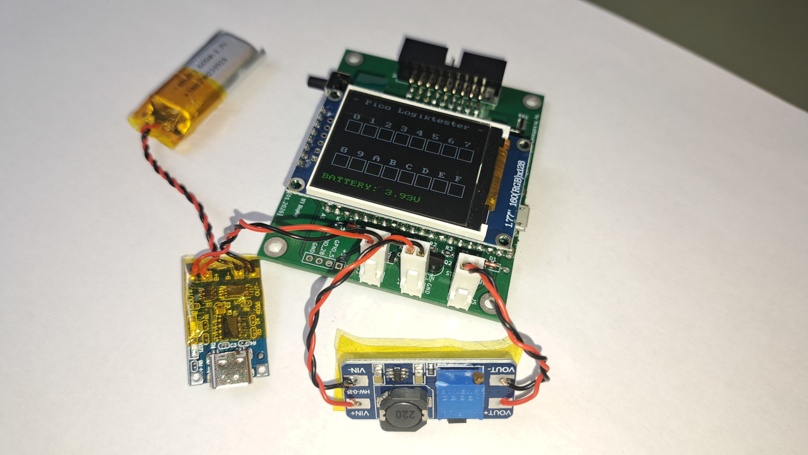
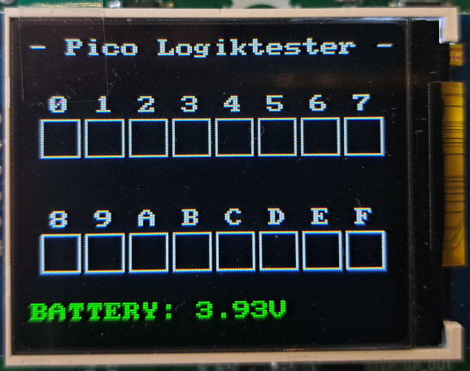
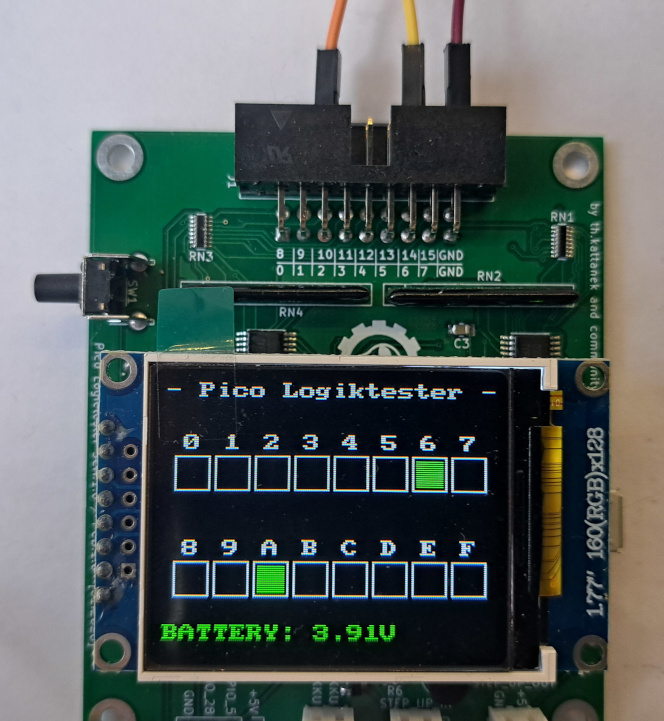
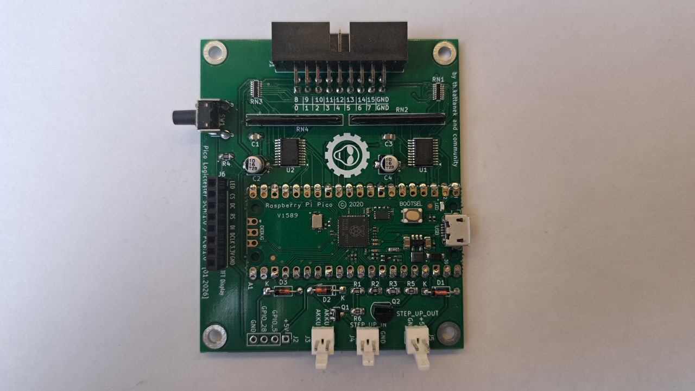

# 🔌 Pico Logic Tester

  

> **Ein portabler 16-Kanal Logic Tester basierend auf dem Raspberry Pi Pico**

Der Pico Logic Tester ist ein handliches Debugging-Tool für Hardware-Entwickler. Er ersetzt die klassischen Test-LEDs und zeigt bis zu 16 digitale Signale gleichzeitig in Echtzeit auf einem farbigen TFT-Display an.


*Der Pico Logic Tester in Aktion*

---

## Key Features

| Feature | Beschreibung |
|---------|-------------|
| **16 Logic Inputs** | GPIO 6-17, 20-22, 26-27 |
| **1,77" TFT Display** | 128x160 Pixel, 16-bit Farbe |
| **Akku-betrieben** | Li-Ion mit USB-C Laden |
| **3.3V & 5V tolerant** | Sichere Eingangsstufe |
| **Echtzeit-Anzeige** | <10ms Reaktionszeit |
| **Open Source** | Hardware & Software frei verfügbar |

---

## 🛠️ Technische Daten

### Hardware Specs
| Komponente | Spezifikation |
|------------|---------------|
| **MCU** | Raspberry Pi Pico (RP2040/RP2350) |
| **Display** | ST7735S, 128×160, SPI |
| **Eingänge** | 16× Digital, 0-5V |
| **Stromversorgung** | 3.7V Li-Ion Akku |
| **Gehäuse** | 120×80×25mm (3D-druckbar) |
| **Gewicht** | ~150g |

### Performance
- **Scan-Rate:** 200Hz (5ms pro Zyklus)
- **Logic Levels:** LOW <0.8V, HIGH >2.5V 
- **Akkulaufzeit:** ~8-12 Stunden aktiv
- **Display-Update:** Nur bei Änderungen (optimiert)

---

## 🚀 Quick Start

### 1. Hardware Setup
```
1. Akku über USB-C laden (grüne LED = voll)
2. Logic Tester einschalten (kurzer Power-Button Druck)
3. GND-Referenz mit Testobjekt verbinden
4. Testleitungen an Eingänge 0-15 anschließen
```

### 2. Display Interpretation


| Anzeige | Bedeutung |
|---------|-----------|
| **Grüne Box** | Logic HIGH (>2.5V) |
| **Schwarze Box** | Logic LOW (<0.8V) |
| **Grün/Gelb/Rot** | Batteriestatus |

### 3. Ein/Ausschalten
- **EIN:** Kurzer Tastendruck (<1s)
- **AUS:** Langer Tastendruck (>2s)
- **Auto-OFF:** Bei kritischem Batteriestand

---

## 📁 Repository Struktur

```
pico_logictester/
├── README.md                    # Diese Datei
├── LICENSE                      # GPL v2 Lizenz
├── firmware/                    # Pico C++ Firmware
│   ├── src/main.cpp               # Hauptprogramm
│   ├── CMakeLists.txt             # Build Config
│   └── include/displaylib_16/     # Display Treiber
├── hardware/                    # KiCad PCB Design
│   ├── pico_logictester.kicad_*   # Schaltplan & Layout
│   ├── gerber/                    # Produktionsdaten
│   └── bom/                       # Interaktive Stückliste
└── doc/                         # Dokumentation
    ├── pico_logictester_dokumentation.md  # Vollständige Doku
    ├── pico_logictester_dokumentation.pdf # PDF Version
    └── images/                     # Bilder & Diagramme
```

---

## 🔨 Build & Flash

### Voraussetzungen
- **Pico SDK** (v2.2.0+)
- **CMake** (v3.13+) 
- **ARM GCC Toolchain**

### Kompilierung
```bash
cd firmware
mkdir build && cd build
cmake ..
make -j4
```

### Programmierung
```bash
# UF2 auf Pico kopieren (BOOTSEL Mode)
cp pico_logictester.uf2 /media/<user>/RPI-RP2/

# Oder mit picotool
picotool load pico_logictester.uf2
```

---

## 📸 Screenshots

<table>
<tr>
<td align="center">
<br>
<b>Logic HIGH Signale</b>
</td>
<td align="center">
<br>
<b>PCB Design</b>
</td>
</tr>
</table>

---

## 📚 Dokumentation

| Dokument | Beschreibung | Format |
|----------|--------------|--------|
| 📋 **[Vollständige Dokumentation](doc/pico_logictester_dokumentation.md)** | Detaillierte Hardware/Software Beschreibung | Markdown |
| 📄 **[PDF Version](doc/pico_logictester_dokumentation.pdf)** | Druckbare Dokumentation | PDF |
| 🔧 **[Hardware BOM](hardware/bom/pico_logictester_pcb_1.0_ibom.html)** | Interaktive Stückliste | HTML |

### Was Sie in der Dokumentation finden:
- **Hardware-Design:** Schaltplan, PCB-Layout, Stückliste
- **Software-Architektur:** C++ Code-Struktur, Performance-Optimierungen  
- **Benutzerhandbuch:** Bedienung, Fehlerbehebung, Kalibrierung
- **Fertigung:** PCB-Produktion, 3D-Druck Gehäuse
- **Entwicklung:** Build-System, Debugging, Erweiterungen

---

## Beitragen

Contributions sind willkommen!

### Wie Sie helfen können:
- **Bug Reports:** Issues über GitHub melden
- **Feature Requests:** Neue Ideen vorschlagen  
- **Code:** Pull Requests für Verbesserungen
- **Dokumentation:** Rechtschreibfehler, Übersetzungen
- **Testing:** Hardware-Tests, Kompatibilitätsprüfung

### Development Workflow:
```bash
1. Fork das Repository
2. Feature Branch erstellen (`git checkout -b feature/amazing-feature`)
3. Änderungen committen (`git commit -m 'Add amazing feature'`)
4. Branch pushen (`git push origin feature/amazing-feature`)
5. Pull Request öffnen
```

---

## 📜 Lizenz

Dieses Projekt steht unter der **GNU General Public License v2.0**.

- ✅ **Kommerzieller Einsatz erlaubt**
- ✅ **Modifikation erlaubt** 
- ✅ **Distribution erlaubt**
- ❗ **Quellcode muss verfügbar sein**
- ❗ **Gleiche Lizenz für Ableitungen**

Siehe [LICENSE](LICENSE) für Details.

---

## Show your Support

Wenn Ihnen dieses Projekt gefällt:
- **Star** das Repository
- **Fork** für eigene Experimente  
- **Teilen** mit anderen Hardware-Hackern
- **Feedback** über Issues

---

## 📞 Kontakt & Support

| Kanal | Link | Beschreibung |
|-------|------|--------------|
| 👤 **Autor** | Thorsten Kattanek | Hardware & Software Development |
| 📧 **E-Mail** | thorsten@kattanek.de | Direkte Fragen & Support |
| 🐙 **GitHub** | [ThKattanek/pico_logictester](https://github.com/ThKattanek/pico_logictester) | Source Code & Issues |
| 🐛 **Bug Reports** | [GitHub Issues](https://github.com/ThKattanek/pico_logictester/issues) | Bugs & Feature Requests |

---

<div align="center">

**Made with ❤️ for Hardware Debugging**

*Happy Coding!*

</div>