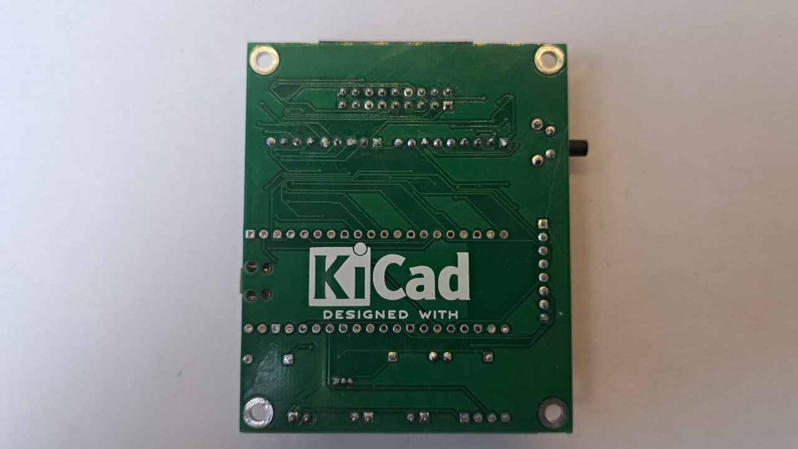
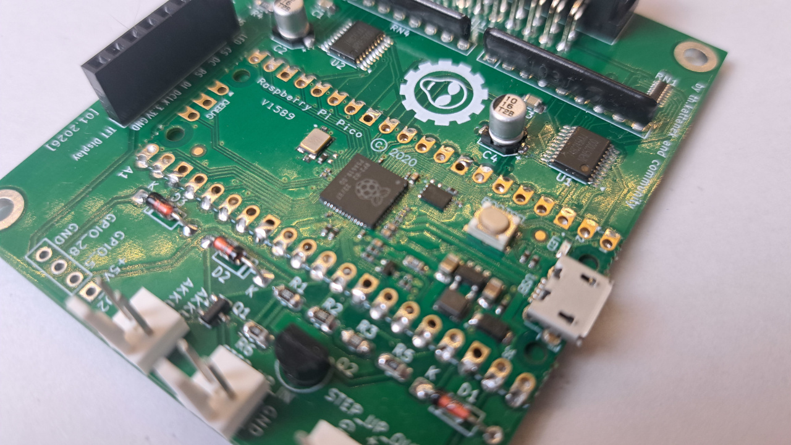
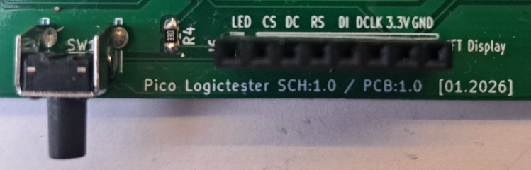

# Pico Logic Tester - Projektdokumentation

**Version:** 1.0  
**Datum:**   21. Februar 2026  
**Autor:**   Thorsten Kattanek  

---

## 1. Projektübersicht

### 1.1 Beschreibung
Der Pico Logic Tester ist ein tragbares Messgerät zur Überwachung digitaler Signale, basierend auf dem Raspberry Pi Pico Mikrocontroller. Das Gerät kann bis zu 16 Logikeingänge gleichzeitig überwachen und den Zustand (HIGH/LOW) in Echtzeit auf einem farbigen TFT-Display anzeigen. Die Eingänge sind 3.3V und 5V Tolerant. Es ersetzt kein Logic Analyzer, vielmehr die LED's zum Debuggen von Hardware Schaltungen.

### 1.2 Hauptmerkmale
- **16 Logikeingänge** (GPIO 6-17, 20-22, 26-27)
- **1,77" ST7735 TFT-Display** (128x160 Pixel)
- **Batterieüberwachung** mit Spannungsanzeige
- **Power-Management** mit Ein-/Ausschaltfunktion
- **Portable Bauweise** mit integrierter Stromversorgung
- **Echtzeit-Anzeige** mit optimierter Performance

### 1.3 Technische Spezifikationen
- **Mikrocontroller:** Raspberry Pi Pico (RP2040) oder Pico2 (RP2350)
- **Betriebsspannung:** 3,3V - 4,2V (Li-Ion Akku)
- **Eingangsspannung:** 0V - 5V (tolerant)
- **Display:** ST7735S, 128x160 Pixel, 16-bit Farbtiefe
- **Kommunikation:** SPI (Display), GPIO (Logikeingänge)
- **Stromverbrauch:** ~50mA (aktiv), <1µA (Standby)

---

## 2. Hardware-Design


*Abbildung 1: Gesamtansicht des Pico Logictester "noch" ohne Gehäuse*

### 2.1 Schaltungsaufbau
Die Hardware basiert auf einem zweischichtigen PCB-Design mit folgenden Hauptkomponenten:


*Abbildung 2: PCB Oberseite mit bestückten Komponenten*


*Abbildung 3: PCB Unterseite mit Leiterbahnen*

#### 2.1.1 Mikrocontroller-Sektion
- **RP2040 oder RP2350** als zentrale Verarbeitungseinheit (auf dem Pico1 oder Pico2 Board)
- **Externe Oszillatorbeschaltung** für stabile Taktversorgung (auf dem Pico1 oder 2 Board)
- **Keine Übertaktung** für einen sicheren und stabilen Betrieb
- **Power-Management-Schaltung** mit PNP-Transistor und MOSFET
- **Das Raspberry Pi Pico Board** wird direkt auf die Platine gelötet


*Abbildung 4: Detailansicht der Pico-Mikrocontroller Sektion*

#### 2.1.2 Eingangsstufe
- **16 Logikeingänge** mit Schutzwiderständen
- **74HC245** als schneller und zuverlässiger Pegelwandler
- **Pull-Down Widerstände** für definierte Pegel

#### 2.1.3 Display-Interface
- **ST7735S TFT-Controller** über SPI-Interface
- **Dedicated GPIO-Pins** für CS, DC, RST, SDIN und SDCLCK


*Abbildung 5: Pin Belegung des TFT Anschluss*

#### 2.1.4 Stromversorgung
- **Li-Ion Akkuanschluss** (3,7V nominal)
- **Laderegler-Modul (18650 Lithium Battery Charger)** mit USB-C Anschluss
- **StepUp Wandler Modul MT3608** erzeugt Stabile 5V für das ganze System
- **Spannungsüberwachung** über ADC-Eingang
- **Power-Switch mit Latching** über Taster

### 2.2 Pin-Belegung

#### 2.2.1 Display-Pins (SPI0)
```
TFT_CS_PIN    = GPIO 2   (Chip Select)
TFT_DC_PIN    = GPIO 3   (Data/Command)
TFT_RST_PIN   = GPIO 4   (Reset)
TFT_SDIN_PIN  = GPIO 19  (MOSI)
TFT_SCLK_PIN  = GPIO 18  (Serial Clock)
```

#### 2.2.2 Power-Management
```
SYSTEM_POWER_PIN = GPIO 0  (Power Control)
POWER_BUTTON_PIN = GPIO 1  (Power Button Input)
BATTERY_ADC_PIN  = GPIO 27 (Battery Voltage Monitoring)
```

#### 2.2.3 Debug-Interface
```
DEBUG_LED_PIN = GPIO 25   (Onboard LED für Status-Anzeige)
```

#### 2.2.3 Logikeingänge
```
LOGIC_PIN_0  = GPIO 6    LOGIC_PIN_8  = GPIO 14
LOGIC_PIN_1  = GPIO 7    LOGIC_PIN_9  = GPIO 15
LOGIC_PIN_2  = GPIO 8    LOGIC_PIN_10 = GPIO 16
LOGIC_PIN_3  = GPIO 9    LOGIC_PIN_11 = GPIO 17
LOGIC_PIN_4  = GPIO 10   LOGIC_PIN_12 = GPIO 20
LOGIC_PIN_5  = GPIO 11   LOGIC_PIN_13 = GPIO 21
LOGIC_PIN_6  = GPIO 12   LOGIC_PIN_14 = GPIO 22
LOGIC_PIN_7  = GPIO 13   LOGIC_PIN_15 = GPIO 26
```

---

## 3. Software-Architektur

### 3.1 Systemarchitektur
Die Firmware ist in C++ geschrieben und verwendet das Pico SDK. Die Software folgt einer ereignisgesteuerten Architektur mit optimierter Performance für Echtzeit-Anwendungen.

### 3.2 Hauptkomponenten

#### 3.2.1 Power Management System
```cpp
// Funktionen:
- InitPowerManagement()      // Initialisierung der Power-Kontrolle
- CheckPowerButton()         // Überwachung des Power-Buttons
- PowerOff()                 // Sicheres Herunterfahren
```

**Features:**
- Interrupt-gesteuerte Tastererkennung
- 2-Sekunden-Timeout für sicheres Ausschalten
- Automatische Abschaltung bei kritischer Batteriespannung

#### 3.2.2 Battery Monitoring System
```cpp
// Funktionen:
- InitBatteryMonitoring()    // ADC-Initialisierung
- ReadBatteryVoltage()       // Spannungsmessung
- UpdateBatteryMovingAverage() // Gleitender Mittelwert
- DisplayBatteryStatus()     // Anzeige der Batteriespannung
```

**Features:**
- 12-bit ADC mit 3,3V Referenz
- 50-Werte gleitender Mittelwert für stabile Messung
- Farbkodierte Warnanzeige (Grün/Gelb/Rot)
- Automatische Abschaltung bei <3,5V

#### 3.2.3 Logic Input System
```cpp
// Funktionen:
- InitLogicPinsAsInput()     // GPIO-Initialisierung
- ReadAllLogicPins()         // Bulk-GPIO-Read
- UpdateLogicDisplay()       // Selektive Display-Updates
```

**Features:**
- Optimierte Bulk-GPIO-Operationen
- Änderungsbasierte Display-Updates
- Sub-10ms Reaktionszeit
- 16MHz SPI für flüssige Anzeige

#### 3.2.4 Display System
Das Display-System basiert auf der `displaylib_16` Bibliothek mit ST7735-Treiber.

**Features:**
- Hardware-SPI mit 16MHz Taktrate
- 16-bit Farbtiefte (65.536 Farben)
- Optimierte Zeichenfunktionen
- Rotationsunterstützung (0°, 90°, 180°, 270°)

#### 3.2.5 Debug-System
```cpp
// Debug-LED Funktionen:
- LED_PIN = GPIO 25          // Onboard-LED des Pico
- gpio_put(LED_PIN, 1)       // LED einschalten bei Startup
- Visueller Indikator für Systemstart
- Debugging-Unterstützung bei Entwicklung
```

**Features:**
- Automatisches LED-Signal beim Systemstart
- Status-Anzeige für Hardware-Debugging
- Einfache Erweiterung für weitere Debug-Signale

### 3.3 Performance-Optimierungen

#### 3.3.1 Echzeit-Verhalten
- **Hauptschleife:** 5ms Zykluszeit
- **GPIO-Read:** Bulk-Operation in <1µs
- **Display-Update:** Nur bei Änderungen
- **Batteriemessung:** 100ms Intervall

#### 3.3.2 Memory Management
- **Stack-optimierte Variablen**
- **Konstante Arrays im Flash**
- **Minimale Heap-Nutzung**
- **Optimierte Puffergröße**

---

## 4. Benutzerhandbuch

### 4.1 Inbetriebnahme

#### 4.1.1 Erste Verwendung
1. **Akku laden:** USB-C Kabel anschließen bis LED grün leuchtet
2. **Einschalten:** Power-Taste kurz drücken
3. **Display-Check:** Anzeige sollte "Pico Logiktester" zeigen
4. **Funktionstest:** Testspannungen an Eingänge anlegen

#### 4.1.2 Bedienung
- **Einschalten:** Kurzer Tastendruck (<1s)
- **Ausschalten:** Langer Tastendruck (>2s)
- **Automatische Abschaltung:** Bei kritischer Batteriespannung

### 4.2 Display-Anzeige


*Abbildung 6: Hauptbildschirm mit allen 16 Logikeingängen*

#### 4.2.1 Bildschirmaufteilung
```
+---------------------------+
|   - Pico Logiktester -    |  <- Header
+---------------------------+
|  0  1  2  3  4  5  6  7   |  <- Eingänge 0-7
| [_][_][_][_][_][_][_][_]  |
|                           |
|  8  9  A  B  C  D  E  F   |  <- Eingänge 8-15 (hex)
| [_][_][_][_][_][_][_][_]  |
+---------------------------+
| BATTERY: 4.05V            |  <- Batterie Anzeige
+---------------------------+
```

#### 4.2.2 Statusanzeige
- **Grüne Box:** Logik HIGH (>2,5V)
- **Schwarze Box:** Logik LOW (<0,8V)
- **Batterieanzeige:**
  - Grün: >3,7V (gut)
  - Gelb: 3,5V-3,7V (niedrig)
  - Rot: <3,5V (kritisch) (system wird automatisch runter gefahren)


*Abbildung 7: Display mit mehreren HIGH-Signalen (grüne Boxen)*

### 4.3 Messverfahren

#### 4.3.1 Digitale Signale
- **Eingangsspannung:** 0V - 5V
- **Schaltschwellen:**
  - LOW: <0,8V
  - HIGH: >2,5V
- **Maximale Frequenz:** ~50Hz (begrenzt durch Display)

#### 4.3.2 Anschluss
1. **GND-Verbindung** zwischen Testobjekt und Logic Tester herstellen
2. **Messleitungen** an zu überwachende Signale anschließen  
3. **Eingangsnummer beachten** (0-15, entspricht GPIO-Mapping)

---

## 5. Entwicklung und Build

### 5.1 Build-System

#### 5.1.1 Voraussetzungen
```bash
# Pico SDK Installation
sudo apt install cmake gcc-arm-none-eabi libnewlib-arm-none-eabi \
                 build-essential libstdc++-arm-none-eabi-newlib

# Pico SDK (Version 2.2.0)
git clone https://github.com/raspberrypi/pico-sdk.git
export PICO_SDK_PATH=/path/to/pico-sdk
```

#### 5.1.2 Kompilierung
```bash
cd firmware
mkdir build && cd build
cmake ..
make -j4
```

#### 5.1.3 Programmierung
```bash
# UF2-Datei auf Pico kopieren (Bootsel-Modus)
cp pico_logictester.uf2 /media/<user>/RPI-RP2/

# Oder mit picotool
picotool load pico_logictester.uf2
```

### 5.2 Entwicklungsumgebung

#### 5.2.1 Empfohlene IDE
- **VS Code** mit Pico Extension

#### 5.2.2 Debugging
```bash
# SWD-Debugging mit Pico Debug Probe
openocd -f interface/cmsis-dap.cfg -f target/rp2040.cfg
arm-none-eabi-gdb build/pico_logictester.elf
```

### 5.3 Code-Struktur

#### 5.3.1 Verzeichnisstruktur
```
firmware/
├── CMakeLists.txt
├── src/
│   ├── main.cpp                 # Hauptprogramm
│   └── displaylib_16/           # Display-Bibliothek
│       ├── st7735.cpp           # ST7735 Treiber
│       ├── displaylib_16_*.cpp  # Grafik-Funktionen
│       └── ...
├── include/
│   └── displaylib_16/           # Header-Dateien
└── build/                       # Build-Artefakte
```

#### 5.3.2 Abhängigkeiten
```cmake
# CMakeLists.txt Ziele
target_link_libraries(pico_logictester
    pico_displaylib_16    # Eigene Display-Bibliothek
    hardware_spi          # SPI-Hardware
    hardware_adc          # ADC-Hardware  
    pico_stdlib           # Pico Standard-Bibliothek
)
```

---

## 6. Hardware-Fertigung

### 6.1 PCB-Spezifikationen

#### 6.1.1 Platinen-Parameter
- **Schichtanzahl:** 2 Layer
- **Platinen-Dicke:** 1,6mm
- **Kupfer-Dicke:** 35µm (1oz)
- **Via-Größe:** min 0,3mm Bohrdurchmesser
- **Leiterbahnbreite:** min. 0,2mm
- **Oberflächenfinish:** Bleifreies HASL

#### 6.1.2 Bestückung
- **SMD-Komponenten:** 0805 und 1206
- **Durchkontaktierte Bauteile:** THT-Stecker
- **Kritische Toleranzen:** ±5% (Widerstände), ±10% (Kondensatoren)

### 6.2 Stückliste (BOM)

Siehe unter hardware/bom, dort gibt es eine Interaktive Stückliste als HTML File. 

### 6.3 Gehäuse

#### 6.3.1 Mechanische Abmessungen
- **Außenmaße:** 120mm x 80mm x 25mm
- **Display-Ausschnitt:** 30mm x 26mm
- **Taster-Bohrung:** Ø6mm
- **Anschluss-Raster:** 2,54mm (16-pol Stiftleiste)

#### 6.3.2 Material-Empfehlungen
- **Gehäuse:** ABS oder PETG (3D-Druck)
- **Display-Schutz:** Acrylglas 2mm
- **Dichtungen:** Silikonprofil für IP54

---

## 7. Fehlerbehebung

### 7.1 Häufige Probleme

#### 7.1.1 Display bleibt schwarz
**Symptome:** Kein Bild nach dem Einschalten
**Ursachen:**
- Unterbrochene SPI-Verbindung
- Defekte Display-Spannungsversorgung
- Falsche Display-Initialisierung

**Lösungsansätze:**
```cpp
// Debug-Code für Display-Test
tft_display.fillScreen(ST7735_TFT::C_RED);  // Test mit rotem Bildschirm
```

#### 7.1.2 Eingänge reagieren nicht
**Symptome:** Keine Änderung der Logic-Anzeige
**Ursachen:**
- GPIO-Pins nicht korrekt initialisiert
- Hardwarefehler auf Eingangsstufe
- Software-Bug in ReadAllLogicPins()

**Lösungsansätze:**
```cpp
// Debug einzelner GPIO-Pin
printf("GPIO %d: %d\n", LOGIC_PIN_0, gpio_get(LOGIC_PIN_0));
```

#### 7.1.3 Batterie-Anzeige falsch
**Symptome:** Unrealistische Spannungswerte
**Ursachen:**
- ADC-Referenzspannung falsch
- Spannungsteiler-Verhältnis inkorrekt
- Schlechte ADC-Kalibrierung

**Lösungsansätze:**
```cpp
// ADC-Rohwerte prüfen
uint16_t raw = adc_read();
printf("ADC raw: %d\n", raw);
```

### 7.2 Debug-Ausgaben

#### 7.2.1 UART-Debugging
```cpp
// main.cpp - Debug-Ausgaben aktivieren
stdio_init_all();
pico_enable_stdio_uart(${PROJECT_NAME} 1);

// Verwenden in Code:
printf("Battery: %.2fV, Logic: 0x%04X\n", battery_voltage, logic_state);
```

#### 7.2.2 LED-Signaling
```cpp
// Status-LED für Fehlerdiagnose (bereits implementiert)
#define DEBUG_LED_PIN 25  // Onboard-LED des Pico
gpio_init(DEBUG_LED_PIN);
gpio_set_dir(DEBUG_LED_PIN, GPIO_OUT);
gpio_put(DEBUG_LED_PIN, 1); // LED an bei Startup

// Erweiterte Fehlercodes durch Blink-Sequenzen
void blink_error_code(int error_code) {
    for(int i = 0; i < error_code; i++) {
        gpio_put(DEBUG_LED_PIN, 1);
        sleep_ms(200);
        gpio_put(DEBUG_LED_PIN, 0);
        sleep_ms(200);
    }
}

// Status-Signale:
// - Dauerhaft AN: System erfolgreich gestartet
// - Blink-Codes: Verschiedene Fehlerzustände
```

---

## 8. Wartung und Pflege

### 8.1 Routinewartung

#### 8.1.1 Batteriepflege
- **Ladezyklen:** Nicht vollständig entladen lassen
- **Lagerung:** Bei 50% SOC lagern wenn unbenutzt
- **Lade-Temperatur:** 10°C - 45°C optimal
- **Austausch:** Nach ca. 500 Ladezyklen

#### 8.1.2 Reinigung
- **Display:** Mit Mikrofasertuch trocken reinigen
- **Gehäuse:** Mit feuchtem Tuch (destilliertes Wasser)
- **Anschlüsse:** Mit Kontaktspray behandeln
- **Lagerung:** In antistatischer Hülle

### 8.2 Kalibrierung

#### 8.2.1 Batteriespannung
```cpp
// Kalibrierung der ADC-Messung
const float ADC_CALIBRATION_FACTOR = 1.02f;  // Anpassung nach Messung
float voltage = adc_raw * ADC_CONVERSION_FACTOR * 
                VOLTAGE_DIVIDER_FACTOR * ADC_CALIBRATION_FACTOR;
```

#### 8.2.2 Eingangsschwellen
```cpp
// Logic-Level Kalibrierung  
const float LOGIC_LOW_THRESHOLD = 0.8f;   // Anpassbar
const float LOGIC_HIGH_THRESHOLD = 2.5f;  // Anpassbar
```

---

## 9. Anhang

### 9.1 Technische Referenzen

#### 9.1.1 Datenblätter
- [RP2040 Datasheet](https://datasheets.raspberrypi.org/rp2040/rp2040-datasheet.pdf)
- [ST7735 Controller](https://www.adafruit.com/datasheets/ST7735R_V0.2.pdf)
- [Pico SDK Documentation](https://raspberrypi.github.io/pico-sdk-doxygen/)

#### 9.1.2 Application Notes
- **AN001:** Power Management Best Practices
- **AN002:** EMV-Design für portable Geräte  
- **AN003:** Li-Ion Battery Safety

### 9.2 Lizenz und Copyright

#### 9.2.1 Software-Lizenz
```
GNU General Public License Version 2

Copyright (C) 2026 Thorsten Kattanek

This program is free software; you can redistribute it and/or modify
it under the terms of the GNU General Public License as published by
the Free Software Foundation; either version 2 of the License, or
(at your option) any later version.

This program is distributed in the hope that it will be useful,
but WITHOUT ANY WARRANTY; without even the implied warranty of
MERCHANTABILITY or FITNESS FOR A PARTICULAR PURPOSE.  See the
GNU General Public License for more details.

You should have received a copy of the GNU General Public License along
with this program; if not, write to the Free Software Foundation, Inc.,
51 Franklin Street, Fifth Floor, Boston, MA 02110-1301 USA.

Die vollständige Lizenz finden Sie in der Datei LICENSE im Repository.
```

#### 9.2.2 Hardware-Lizenz
Das Hardware-Design steht unter Creative Commons Attribution-ShareAlike 4.0 International License.

**Autor:** Thorsten Kattanek  
**E-Mail:** mail@thorsten-kattanek.de  
**Repository:** https://github.com/ThKattanek/pico_logictester  
**Issues:** Bug-Reports und Feature-Requests über GitHub Issues

---

*Dokumentation erstellt am 21. Februar 2026*  
*Version 1.0*